# UniDue — 大学生向け 課題期日管理アプリ

## 現状の課題
- 私の通っている大学のポータルサイトがリニューアルされ、全授業の課題の一覧が見れなくなった。
- 今自分に課されている課題を把握し切れず、課題の存在を忘れることが多々あった。

## 解決手法
- 全授業の全課題を期日が近い順に一覧表示されるアプリがあれば、課題の存在を忘れることがなくなる。
- 課題が出るたび、その課題の名前と概要をこのアプリに登録すれば、登録した課題が期日近い順に一覧表示される。

## 想定ユーザー
- 大学1年~4年生、特に文系(もちろん理系でも可)

## UniDueアプリの機能
- 課題の一覧表示
- 完了済み課題の一覧表示
- 期限切れ＆未完了課題の一覧表示
- 課題の登録
- 課題の編集
- 課題の削除


## 名前の由来（UniDue）
「大学（University）の課題の期日（Due）を統合管理(Unified)」というコンセプトから、「UniDue」と命名。

<br><br><br>

## スクリーンショット

### 1. トップページ
<p align="center">
  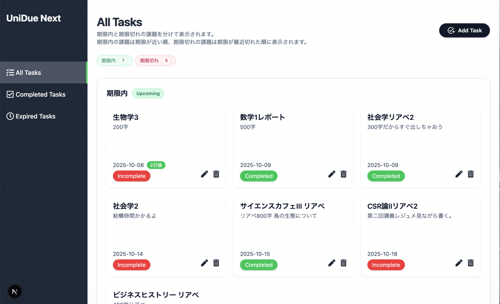
</p>

<br>
<p align="center">
  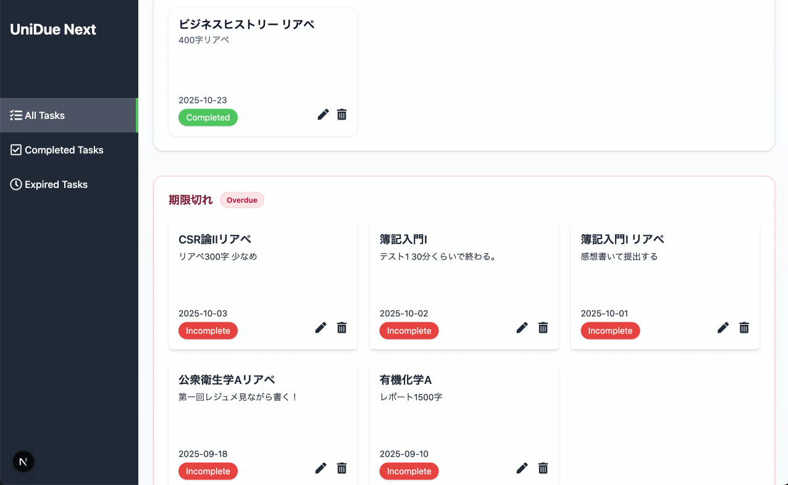
</p>

<br>
<p align="center">
  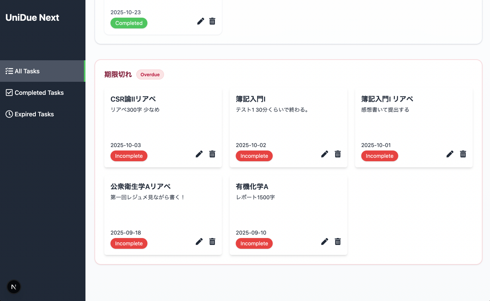
</p>

<br>
<p align="center">
  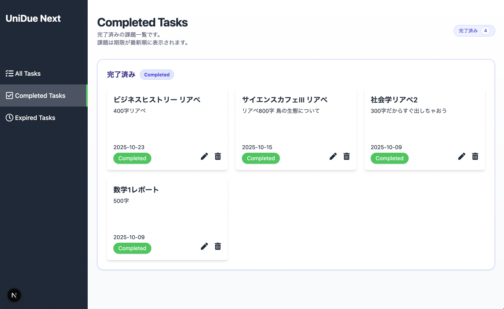
</p>
---

<br>
<p align="center">
  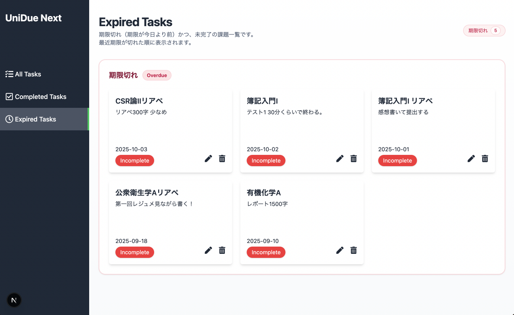
</p>
--------------
<br>
<p align="center">
  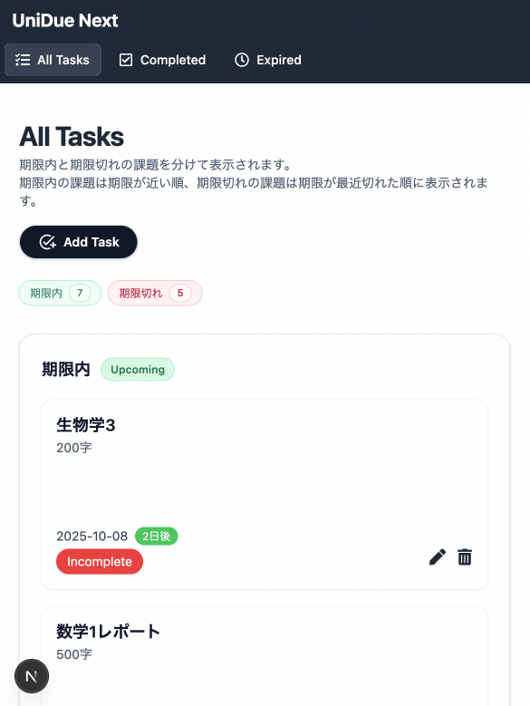
</p>

<br>
<p align="center">
  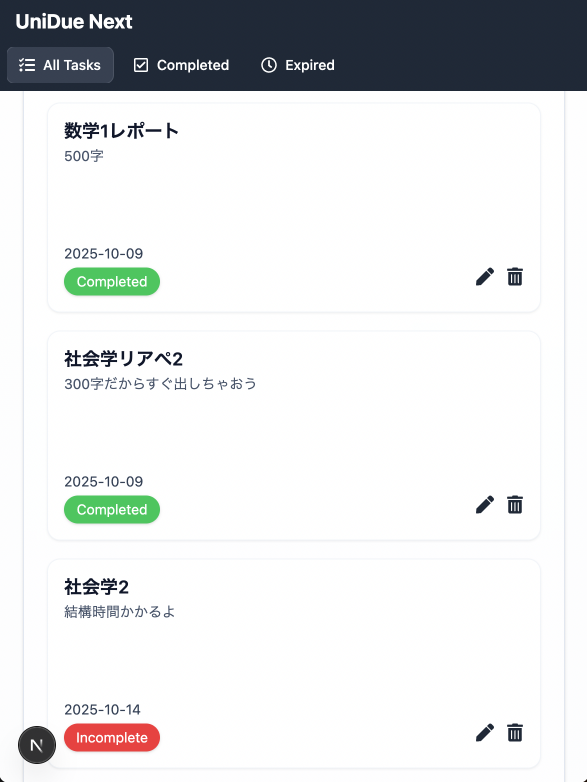
</p>

<br>
<p align="center">
  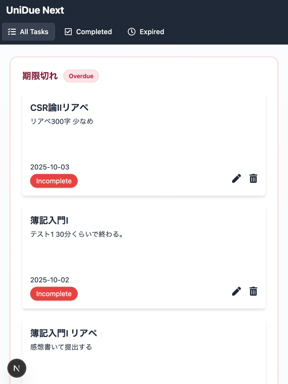
</p>

<br>
<p align="center">
  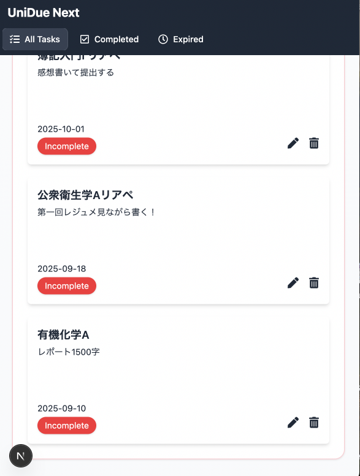
</p>

<br>
<p align="center">
  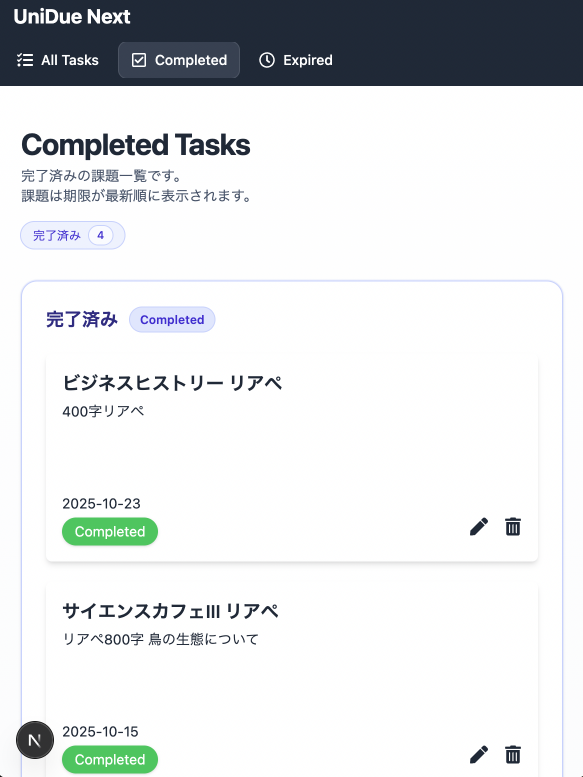
</p>

<br>
<p align="center">
  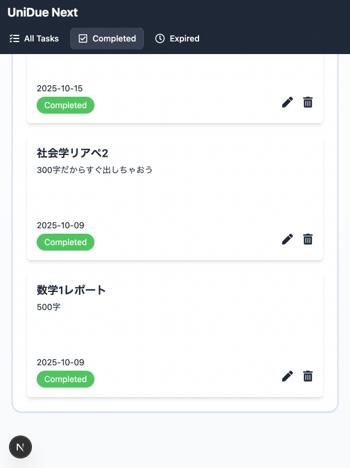
</p>

<br>
<p align="center">
  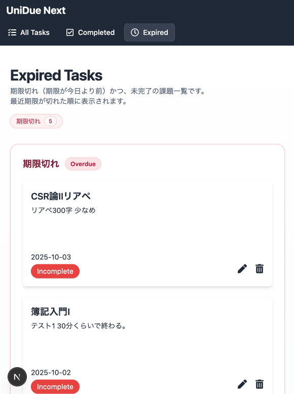
</p>

<br>
<p align="center">
  
</p>

<br>
<p align="center">
  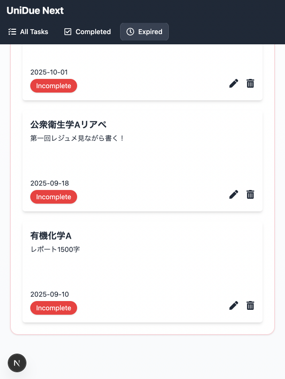
</p>

<br>
<br>
### 2.新規課題作成ページ
<p align="center">
  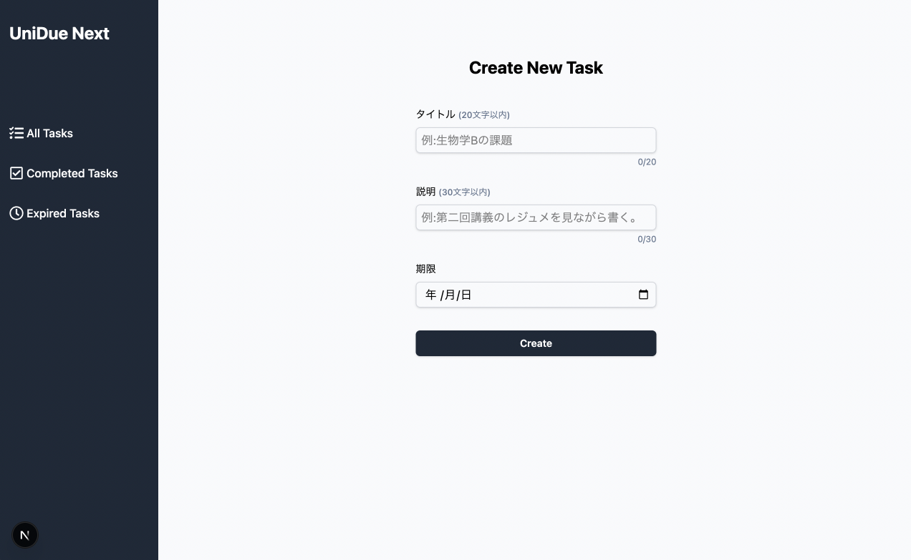
</p>
--------------
<br>
<p align="center">
  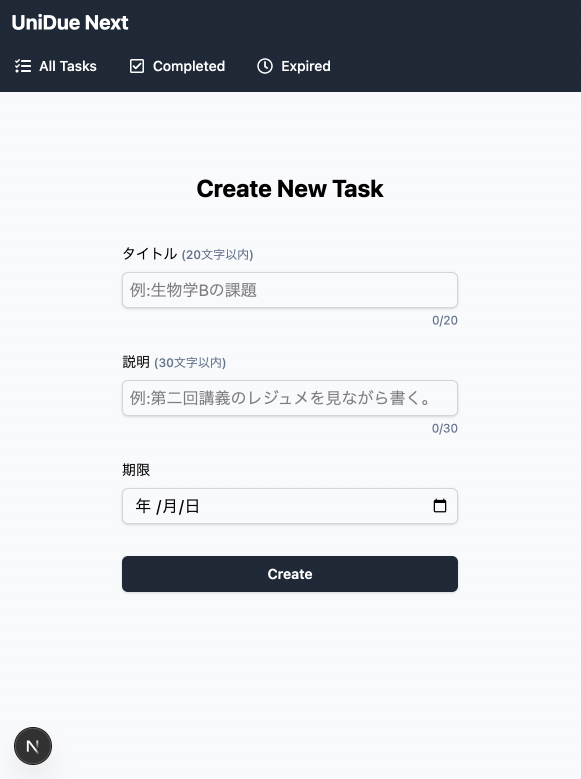
</p>

<br>
<br>
### 3.課題情報編集ページ
<p align="center">
  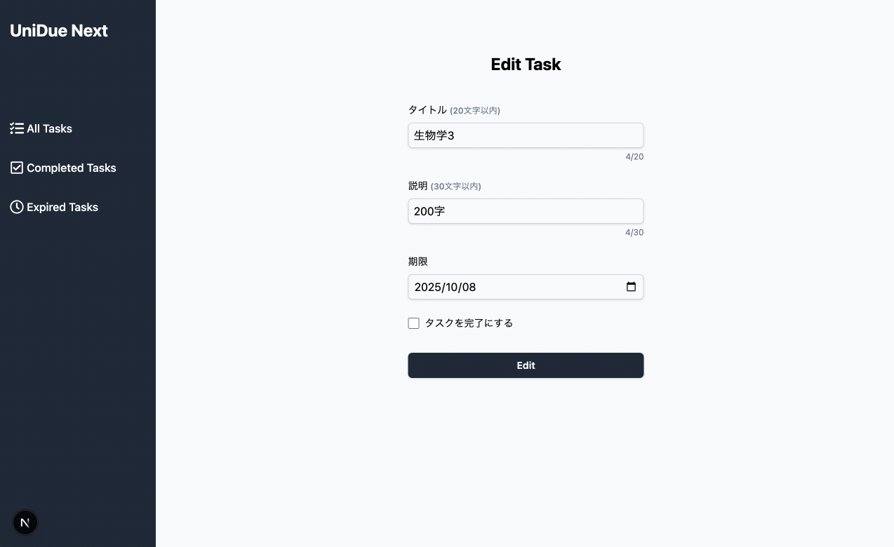
</p>
--------------
<br>
<p align="center">
  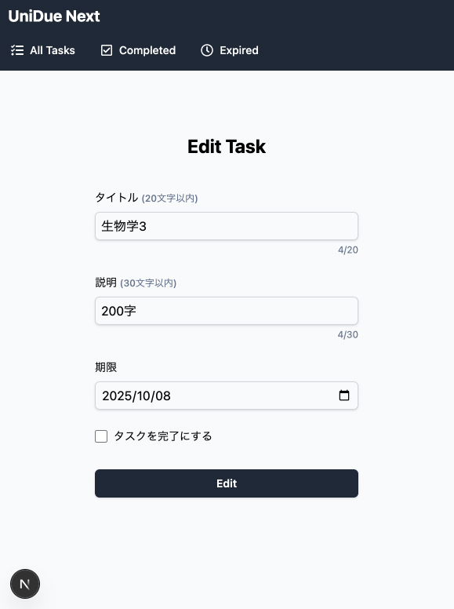
</p>


This is a [Next.js](https://nextjs.org) project bootstrapped with [`create-next-app`](https://github.com/vercel/next.js/tree/canary/packages/create-next-app).

## Getting Started

First, run the development server:

```bash
npm run dev
# or
yarn dev
# or
pnpm dev
# or
bun dev

The easiest way to deploy your Next.js app is to use the [Vercel Platform](https://vercel.com/new?utm_medium=default-template&filter=next.js&utm_source=create-next-app&utm_campaign=create-next-app-readme) from the creators of Next.js.

Check out our [Next.js deployment documentation](https://nextjs.org/docs/app/building-your-application/deploying) for more details.
